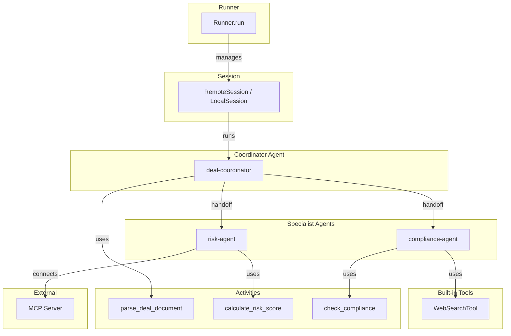

# Durable Agents: LLM Agents on Mistral Workflows

Durable Agents allow you to run LLM agents within your Mistral workflows.

## Installation

To use Durable Agents, install the Mistral plugin:

```bash
uv add 'mistralai-workflows[mistralai]'
```

## What is a Durable Agent?

A Durable Agent is an LLM agent that executes within a workflow, benefiting from:

- **Durability**: Agent state is preserved across failures and restarts
- **Tool Integration**: Use activities as agent tools
- **Multi-Agent Handoffs**: Agents can delegate tasks to specialized agents
- **MCP Support**: Connect to external tools via Model Context Protocol (stdio / SSE / Streamable HTTP)

## Architecture Overview



The Runner orchestrates agent execution through a Session. Agents can hand off tasks to specialized agents and each agent can use activities, built-in Mistral tools or MCP servers as tools.

## Core Components

### Agent

The `Agent` class defines an LLM agent with its model, instructions, tools and handoffs:

```python
import mistralai.workflows as workflows
import mistralai.workflows.plugins.mistralai as workflows_mistralai

agent = workflows_mistralai.Agent(
    model="mistral-medium-latest",
    name="my-agent",
    description="Agent that performs specific tasks",
    instructions="Use tools to complete the user's request.",
    tools=[my_activity],  # Workflows activities as tools
    handoffs=[other_agent],  # Agents to delegate to
)
```

### Runner

The `Runner` executes an agent with user inputs and manages the conversation loop:

```python
import mistralai.workflows as workflows
import mistralai.workflows.plugins.mistralai as workflows_mistralai

outputs = await workflows_mistralai.Runner.run(
    agent=agent,
    inputs="What is the interest rate for 2024?",
    session=session,
    max_turns=10,
)
```

### Sessions

Sessions manage agent state and API communication. Two session types are available:

| Session         | Use Case                   | Backend               |
| --------------- | -------------------------- | --------------------- |
| `RemoteSession` | Production (recommended)   | Mistral Agents SDK    |
| `LocalSession`  | Experimental / On-premises | Direct completion API |

## Basic Example

Here's a simple agent workflow that uses an activity as a tool:

```python
import mistralai.client.models
import mistralai.workflows as workflows
import mistralai.workflows.plugins.mistralai as workflows_mistralai

@workflows.activity()
async def get_interest_rate(year: int) -> dict:
    """Get the interest rate for a given year.

    Args:
        year: The year to get the interest rate for
    """
    # Your implementation here
    return {"interest_rate": 1.62}

@workflows.workflow.define(name="finance_agent_workflow")
class FinanceAgentWorkflow:
    @workflows.workflow.entrypoint
    async def entrypoint(self, question: str) -> dict:
        session = workflows_mistralai.RemoteSession()

        agent = workflows_mistralai.Agent(
            model="mistral-medium-latest",
            name="finance-agent",
            description="Agent for financial queries",
            instructions="Use tools to answer financial questions.",
            tools=[get_interest_rate],
        )

        outputs = await workflows_mistralai.Runner.run(
            agent=agent,
            inputs=question,
            session=session,
        )

        answer = "\n".join([
            output.text for output in outputs
            if isinstance(output, mistralai.client.models.TextChunk)
        ])

        return {"answer": answer}
```

## Multi-Agent Handoffs

Agents can delegate tasks to specialized agents using handoffs. The system automatically manages the handoff conversation:

```python
import mistralai.workflows as workflows
import mistralai.workflows.plugins.mistralai as workflows_mistralai

## Create a specialized agent for interest rate queries
interest_rate_agent = workflows_mistralai.Agent(
    model="mistral-medium-latest",
    name="ecb-interest-rate-agent",
    description="Agent for European Central Bank interest rate research",
    instructions="Use tools to get the interest rate for a given year.",
    tools=[get_interest_rate],
)

## Main agent that can hand off to the specialist
finance_agent = workflows_mistralai.Agent(
    model="mistral-medium-latest",
    name="finance-agent",
    description="Agent for financial queries",
    handoffs=[interest_rate_agent],  # Can delegate to interest_rate_agent
)

outputs = await workflows_mistralai.Runner.run(
    agent=finance_agent,
    inputs="What was the ECB interest rate in 2023?",
    session=workflows_mistralai.RemoteSession(),
)
```

When the finance agent receives a query about ECB interest rates, it can automatically hand off to the specialized `interest_rate_agent`.

## MCP Integration

Connect to external tool servers using the Model Context Protocol. Three transport types are supported:

### Stdio MCP Server

For local command-line MCP servers:

```python
import mistralai.workflows.plugins.mistralai as workflows_mistralai

mcp_config = workflows_mistralai.MCPStdioConfig(
    command="npx",
    args=["-y", "@modelcontextprotocol/server-everything"],
    name="server-everything",
)

agent = workflows_mistralai.Agent(
    model="mistral-medium-latest",
    name="mcp-agent",
    description="Agent with access to MCP tools",
    mcp_clients=[mcp_config],
)
```

#### Forwarding credentials to a stdio server

Some stdio MCP servers need credentials (e.g. a bot token) to authenticate. Use
`env_mapping` to inject them from the worker's environment into the subprocess.
The mapping goes from **subprocess variable name** to **worker variable name**:

```python
import mistralai.workflows.plugins.mistralai as workflows_mistralai

mcp_config = workflows_mistralai.MCPStdioConfig(
    command="npx",
    args=["-y", "@notionhq/notion-mcp-server"],
    name="notion_bot_a",
    env_mapping={"NOTION_TOKEN": "NOTION_TOKEN_BOT_A"},
)
```

Why pass a mapping instead of the raw values? Activity inputs are persisted to
the Temporal event history, so loading secrets from the worker's environment and
passing them directly would expose them there. With `env_mapping`, only the
mapping names are serialized into activity params and event history; the secret
values are read from the worker's environment inside the activity and never leave
it. This also lets you run several instances of the same server with different
credentials (e.g. `NOTION_TOKEN_BOT_A` and `NOTION_TOKEN_BOT_B`) on one worker.
If a declared worker variable is missing from the environment, the activity
fails fast.

### SSE MCP Server

For remote MCP servers over Server-Sent Events:

```python
import mistralai.workflows.plugins.mistralai as workflows_mistralai

mcp_config = workflows_mistralai.MCPSSEConfig(
    url="https://your-mcp-server.com/sse",
    timeout=60,
    name="remote-tools",
    headers={"Authorization": "Bearer your-token"},  # Optional
)

agent = workflows_mistralai.Agent(
    model="mistral-medium-latest",
    name="sse-mcp-agent",
    description="Agent with access to remote MCP tools",
    mcp_clients=[mcp_config],
)
```

### Streamable HTTP MCP Server

For remote MCP servers that speak the Streamable HTTP transport (`--transport http`),
such as a self-hosted server behind an HTTP endpoint:

> **Requires `mistralai>=2.8.0`.** The Streamable HTTP client ships in the `mistralai`
> client from 2.8.0 (client-python#592). This plugin keeps a permissive floor
> (`mistralai>=2.0.0`), so if you use `MCPStreamableHTTPConfig`, pin
> `mistralai>=2.8.0` in your own project's dependencies.

```python
import mistralai.workflows.plugins.mistralai as workflows_mistralai

mcp_config = workflows_mistralai.MCPStreamableHTTPConfig(
    url="https://your-mcp-server.com/mcp",
    name="remote-tools",
)

agent = workflows_mistralai.Agent(
    model="mistral-medium-latest",
    name="streamable-http-mcp-agent",
    description="Agent with access to a Streamable HTTP MCP server",
    mcp_clients=[mcp_config],
)
```

#### Forwarding credentials to a Streamable HTTP server

A Streamable HTTP server usually needs credentials on every request: a bearer token
gating the endpoint and/or a per-request integration token. Set them from the
worker's environment so no secret is ever serialized into the Temporal event history
(the same reasoning as `env_mapping` above).

Use `auth_token_env` for the endpoint bearer. The SDK reads the raw token from that
worker variable inside the activity and sends it as `Authorization: Bearer <value>`,
so store the raw token in your secret manager and let the SDK add the scheme:

```python
mcp_config = MCPStreamableHTTPConfig(
    url="https://your-mcp-server.com/mcp",
    name="remote-tools",
    auth_token_env="MCP_ENDPOINT_TOKEN",
)
```

Use `header_mapping` for any other per-request secret header. Like `env_mapping`,
each entry maps an **HTTP header name** to a **worker variable name**, and only the
names are serialized; the values are read from the worker's environment inside the
activity:

```python
mcp_config = MCPStreamableHTTPConfig(
    url="https://your-mcp-server.com/mcp",
    name="notion",
    auth_token_env="MCP_ENDPOINT_TOKEN",                    # -> Authorization: Bearer <value>
    header_mapping={"Notion-Token": "NOTION_TOKEN_BOT_A"},  # header <- whole env value
)
```

Only put non-secret values in the static `headers` field, since those are serialized
into activity params. As with `env_mapping`, a declared worker variable that is
missing from the environment makes the activity fail fast. A fresh client is opened
per call, so different callers or tokens never share a session.

**Redirects**

By default the client does **not** follow HTTP redirects (`follow_redirects=False`).
On a redirect, `httpx` only strips the `Authorization` header on cross-origin hops,
so the per-request secret headers above (e.g. `Notion-Token`) would be resent to the
redirect target, letting a compromised or open-redirecting MCP exfiltrate them. If
your MCP server relies on redirects (for example `/mcp` -> `/mcp/`) and you trust
every host it can redirect to, opt in:

```python
mcp_config = MCPStreamableHTTPConfig(
    url="https://your-mcp-server.com/mcp",
    name="remote-tools",
    follow_redirects=True,
)
```

## Built-in Tools

Use Mistral's built-in tools alongside activities:

```python
import mistralai.client.models
import mistralai.workflows as workflows
import mistralai.workflows.plugins.mistralai as workflows_mistralai

agent = workflows_mistralai.Agent(
    model="mistral-medium-latest",
    name="web-search-agent",
    description="Agent with web search capability",
    instructions="Use web search to answer user questions",
    tools=[mistralai.client.models.WebSearchTool()],
)
```

Available built-in tools:

- `mistralai.client.models.WebSearchTool()` - Web search capability
- `mistralai.client.models.CodeInterpreterTool()` - Code execution
- `mistralai.client.models.ImageGenerationTool()` - Image generation
- `mistralai.client.models.DocumentLibraryTool()` - Document analysis

## Session Types

### RemoteSession (Recommended)

Uses the Mistral Agents SDK for production workloads:

```python
import mistralai.workflows as workflows
import mistralai.workflows.plugins.mistralai as workflows_mistralai

session = workflows_mistralai.RemoteSession()

outputs = await workflows_mistralai.Runner.run(
    agent=agent,
    inputs="Your question here",
    session=session,
)
```

Features:

- Full Agents SDK integration
- Automatic agent creation and updates
- Managed conversation state
- Production-ready

### LocalSession (Experimental)

Runs agents locally using the completion endpoint:

```python
import mistralai.workflows as workflows
import mistralai.workflows.plugins.mistralai as workflows_mistralai

session = workflows_mistralai.LocalSession()

outputs = await workflows_mistralai.Runner.run(
    agent=agent,
    inputs="Your question here",
    session=session,
)
```

Use cases:

- On-premises deployments that does not have access to Agents (Bora)
- Development and testing
- Full context control

:::warning
`LocalSession` is experimental and may be removed in future versions. Use `RemoteSession` for production workloads.
:::

## Complete Workflow Example

A full example combining activities, handoffs and workflow orchestration:

```python
import asyncio
import mistralai.client.models
import mistralai.workflows as workflows
import mistralai.workflows.plugins.mistralai as workflows_mistralai

@workflows.activity()
async def calculate_risk_score(deal_type: str, amount: float) -> dict:
    """Calculate financial risk score for a deal.

    Args:
        deal_type: The type of deal being analyzed
        amount: The monetary amount of the deal
    """
    risk_score = min(100.0, amount / 10000.0)
    risk_factors = []
    if amount > 100000:
        risk_factors.append("High value transaction")
    return {"risk_score": risk_score, "risk_factors": risk_factors}

@workflows.workflow.define(name="deal_analysis_workflow")
class DealAnalysisWorkflow:
    @workflows.workflow.entrypoint
    async def entrypoint(self, deal_request: str) -> dict:
        """Analyze a deal request.

        Args:
            deal_request: The deal request to analyze
        """
        session = workflows_mistralai.RemoteSession()

        # Risk assessment agent
        risk_agent = workflows_mistralai.Agent(
            model="mistral-medium-latest",
            name="risk-agent",
            description="Analyzes financial risk of deals",
            instructions="Use the risk calculation tool to assess deal risk.",
            tools=[calculate_risk_score],
        )

        # Main coordinator agent
        coordinator = workflows_mistralai.Agent(
            model="mistral-medium-latest",
            name="deal-coordinator",
            description="Coordinates deal analysis",
            instructions="Analyze the deal request and hand off to specialists.",
            handoffs=[risk_agent],
        )

        outputs = await workflows_mistralai.Runner.run(
            agent=coordinator,
            inputs=deal_request,
            session=session,
        )

        analysis = "\n".join([
            output.text for output in outputs
            if isinstance(output, mistralai.client.models.TextChunk)
        ])

        return {"analysis": analysis}

if __name__ == "__main__":
    asyncio.run(workflows.run_worker([DealAnalysisWorkflow]))
```

The worker in this scaffold auto-discovers `@workflows.workflow.define` classes under `apps/worker/src/worker/workflows/`, so the `run_worker` block above is unnecessary. Start the worker with `mistral apps dev --filter worker --json` from the project root.
## Best Practices

1. **Use RemoteSession for production** - It provides better reliability and Agents SDK integration
2. **Keep activities granular** - Small, focused activities work better as agent tools
3. **Provide clear instructions** - Agent performance depends on clear instructions
4. **Use handoffs for specialization** - Create specialized agents for specific domains and improve context management by delegating tasks
5. **Handle tool errors gracefully** - Activities used as tools should return meaningful error messages
