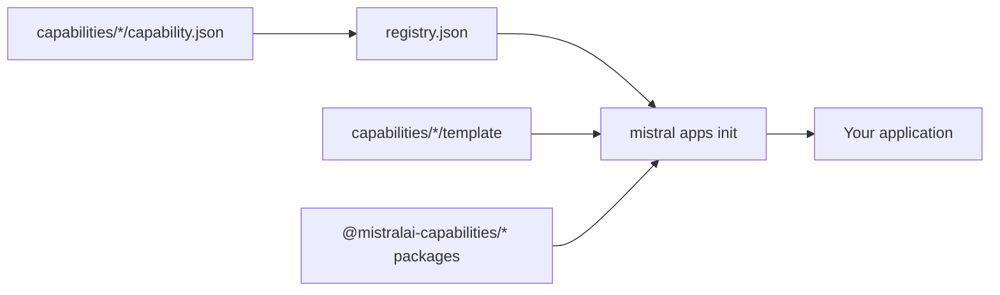

<!-- prettier-ignore -->
<div align="center">

# mistralai-capabilities

**The capability registry for [Mistral Apps](https://github.com/mistralai-solutions/mistral-apps).**
Compose a production-ready AI application from parts that are already built, tested, and deployable.

[](https://github.com/mistralai/mistralai-capabilities/actions/workflows/framework-check.yaml)
[](https://github.com/mistralai/mistralai-capabilities/releases)
[](https://www.python.org/)
[](https://bun.sh/)

[Overview](#overview) • [Quick start](#quick-start) • [Capabilities](#capabilities) • [Generated app](#inside-a-generated-app) • [Development](#work-on-the-registry) • [Troubleshooting](#troubleshooting)

</div>

Each capability under `capabilities/<kind>/<id>` is one self-contained feature: agents, chat, hybrid
search, document processing, speech, and more. The `mistral apps` CLI reads this registry and
vendors the capabilities that you select into a new application. You get a working monorepo, not a
snippet to paste.

> [!NOTE]
> This repository replaces `mistralai-solutions/solutions-capabilities`, which is deprecated. The
> published npm scope `@mistralai-capabilities/*` does not change.

## Overview

A capability registry is a catalog plus a delivery mechanism. The repository root holds
`registry.json`, the descriptor that the CLI reads. Each capability declares what it needs, what it
publishes, and which files it adds to an application.



Select `chat` and the CLI also installs `core`, `fastapi`, `tanstack-start`, `agents`, and their own dependencies
(`workflows`, `postgres`), because `chat` declares them. The result is one bun and uv monorepo with
a FastAPI backend, a React frontend, and a durable worker. Deployment (Docker Compose, Helm, k3d)
and repository tooling (quality, testing, CI, editor) are separate optional capabilities you add on
top.

### Features

- **22 capabilities**, from the application shell to hybrid search, observability, and document extraction.
- **Transitive selection.** A capability declares its dependencies. The CLI resolves them.
- **Two delivery modes.** Vendor the whole registry as a git subtree, or install versioned packages
  from a package index.
- **Composition safety.** Tests prove that no two capabilities write the same file, that the
  dependency graph has no cycle, and that an application still resolves when you deselect an
  optional module.
- **Deployment optional.** Docker Compose, Helm and k3d are all opt-in. A deployment-free
  app runs its modules directly, and each deployment workflow (APISIX gateway, Keycloak, umbrella
  Helm chart, local k3d cluster) is one selectable capability you can add or remove cleanly.
- **One build, two indexes.** A release publishes to Gemfury and Cloudsmith, and each index serves
  an app that resolves everything private from that same index.

### Why a separate repository?

This registry is shipped into generated apps, not just used inside Mistral. In Git mode, `mistral apps`
vendors the source repository as a subtree. Keeping it separate from `dashboard` keeps unrelated
Dashboard code out of that tree and lets authors develop and upstream capabilities with ordinary Git,
without a custom subdirectory-vendoring workflow.

This boundary keeps dashboard-only `workspace:*` packages from resolving locally by accident, gives the
registry its own release tags, and lets contributors work without Dashboard access.

## Quick start

### Prerequisites

| Tool                              | Version       | Purpose                          |
| --------------------------------- | ------------- | -------------------------------- |
| [Bun](https://bun.sh/)            | 1.4.0         | TypeScript workspace and scripts |
| [Python](https://www.python.org/) | 3.14          | Application and registry tooling |
| [uv](https://docs.astral.sh/uv/)  | 0.11.17       | Python workspace and locking     |
| [Docker](https://www.docker.com/) | with BuildKit | Local stack and image builds     |

Docker is needed whenever you build or run images: for `docker-compose` (the local stack), and also for
`k3d`, whose `k3d-up.sh` uses Docker to build, save, and import every selected runtime image.
Kubernetes work additionally needs `helm`, `kubectl`, `k3d`, and `kubeconform`, and only when you
select the opt-in `helm` or `k3d` deployment capabilities; a deployment-free app needs none of them.

### Create an application

Install the CLI:

```bash
curl -fsSL https://raw.githubusercontent.com/mistralai/cli/main/install.sh | bash
```

Create an application. Run interactively and the command groups the choices by kind (base, frontend,
backend, database, feature, deployment, tooling), then vendors them. Pin the
[latest release](https://github.com/mistralai/mistralai-capabilities/releases/latest):

```bash
mistral apps init my-app \
  --registry-url=https://github.com/mistralai/mistralai-capabilities#v0.1.4
```

For a non-interactive default starter, add `--yes`: it selects the capabilities marked **Default**
in the [table below](#capabilities), plus their dependencies, rather than the whole catalog. That set
does **not** include `docker-compose`, so a `--yes` app has no local stack until you add it. Scripted
selections use `--caps` with qualified or unambiguous bare capability references (for example
`--caps chat,docker-compose,code-quality,testing`); `--caps` replaces the default set rather than
extending it, and the CLI expands each selection's dependency closure.

Start it (with `docker-compose` selected):

```bash
cd my-app
# init already wrote .env and .npmrc; set MISTRAL_API_KEY in .env for live model calls
bun run install-all           # sync uv and bun workspaces, install hooks
bunx nx run compose:dev       # hot-reload stack in the foreground
```

Open <http://localhost:9080> and sign in with `dev` / `dev`. A fresh app ships no database
migration yet, so generate and apply the first one before signing in; the
[`create-usecase`](skills/create-usecase/SKILL.md) skill's _Run_ step has the commands and its
_Pitfalls_ cover the usual install failures.

> [!TIP]
> `bunx nx show projects` is the authoritative catalog of the projects your selection installed — it
> lists exactly the projects the capabilities you chose contribute, and nothing for concerns you
> left out. `bun run check` runs every check that your machine can run, and prints a skip line
> for each one that it cannot.

## Capabilities

`core` is the required application base and is always installed (shown but locked in the picker).
Every other capability is optional and grouped by **kind** — frontend, backend, database, feature,
deployment, and tooling. The **Default** column marks the capabilities `mistral apps init --yes`
pre-selects; the CLI installs the dependencies of each capability you select. At most one frontend
may be chosen; every other kind allows any number.

<!-- table:start -->
<!-- Generated by `bun run docs:build` from capabilities/*/capability.json. Do not edit by hand. -->

| Capability                            | Kind         | Required | Default | What it adds                                                                                                                                                                                                                                                                                                                                                                                                                                                                                                                                                                                                                                                                                                                                                                                | Depends on                                                                                  |
| ------------------------------------- | ------------ | -------- | ------- | ------------------------------------------------------------------------------------------------------------------------------------------------------------------------------------------------------------------------------------------------------------------------------------------------------------------------------------------------------------------------------------------------------------------------------------------------------------------------------------------------------------------------------------------------------------------------------------------------------------------------------------------------------------------------------------------------------------------------------------------------------------------------------------------- | ------------------------------------------------------------------------------------------- |
| `base/core`                           | `base`       | Yes      | —       | Required application workspace shell: Bun and uv roots, NX project discovery, repeatable install and lock commands, and shared app-local settings, logging, telemetry, client, and command-line utilities.                                                                                                                                                                                                                                                                                                                                                                                                                                                                                                                                                                                  | —                                                                                           |
| `backend/fastapi`                     | `backend`    | —        | Yes     | The app's HTTP backend: a generic FastAPI application at apps/api with the file-based router and health routes. Feature capabilities register their routers into it.                                                                                                                                                                                                                                                                                                                                                                                                                                                                                                                                                                                                                        | `core`                                                                                      |
| `backend/workflows`                   | `backend`    | —        | Yes     | The app's durable worker: a uv project at apps/worker running the Temporal-backed workflow worker. It exposes no public port.                                                                                                                                                                                                                                                                                                                                                                                                                                                                                                                                                                                                                                                               | `core`                                                                                      |
| `frontend/tanstack-start`             | `frontend`   | —        | Yes     | The app's frontend: a plain TanStack Start application at apps/web — file-based routes, TanStack Query, Tailwind, public packages only. Other capabilities add pages as route files.                                                                                                                                                                                                                                                                                                                                                                                                                                                                                                                                                                                                        | `core`                                                                                      |
| `feature/fastapi-auth`                | `feature`    | —        | —       | FastAPI × auth integration. Owns the gateway-identity gate/types/store seam, the Postgres user-store adapter that apps/api mounts, and the authenticated /api/v1 mount. Hidden: it activates automatically when FastAPI and auth are both effective, and selecting it directly is shorthand for that set. Generic database workspace wiring, lifecycle and readiness follow the postgres capability independently.                                                                                                                                                                                                                                                                                                                                                                          | —                                                                                           |
| `feature/fastapi-postgres`            | `feature`    | —        | —       | Hidden FastAPI × Postgres integration carrying database health and shutdown hooks.                                                                                                                                                                                                                                                                                                                                                                                                                                                                                                                                                                                                                                                                                                          | —                                                                                           |
| `feature/fastapi-tanstack-start`      | `feature`    | —        | —       | FastAPI × TanStack Start integration. Owns the typed API client apps/web generates from the FastAPI OpenAPI contract (hey-api, under src/api/), its runtime base-URL config and the VITE_API_URL env schema. Hidden: it activates automatically when FastAPI and TanStack Start are both effective.                                                                                                                                                                                                                                                                                                                                                                                                                                                                                         | —                                                                                           |
| `feature/fastapi-workflows`           | `feature`    | —        | —       | Hidden FastAPI × workflows integration carrying API health metadata.                                                                                                                                                                                                                                                                                                                                                                                                                                                                                                                                                                                                                                                                                                                        | —                                                                                           |
| `feature/fastapi-workflows-auth`      | `feature`    | —        | —       | FastAPI × workflows authenticated execution integration. Owns the WorkflowRouter HTTP surface, the execution command/ownership/schema layer and its Postgres store, and workflow encryption setup. Hidden: it activates when FastAPI, auth and workflows are effective; its Postgres dependency supplies durable ownership and idempotency. The workflows capability independently supplies the API's workflows-app workspace edge.                                                                                                                                                                                                                                                                                                                                                         | `postgres`                                                                                  |
| `feature/mistral-design-system`       | `feature`    | —        | Yes     | The Mistral look for apps/web: @mistralai/ui with its theme and fonts, the sidebar app shell as a pathless `_app` layout route whose nav is read from each route's staticData, the shared page components, and the vendored atelier components under packages/ts/atelier.                                                                                                                                                                                                                                                                                                                                                                                                                                                                                                                   | `core`, `tanstack-start`                                                                    |
| `database/bucket`                     | `database`   | —        | —       | Bucket: an S3-compatible local object-storage backend powered by the upstream RustFS image, whose Docker Compose overlay ships with the docker-compose capability.                                                                                                                                                                                                                                                                                                                                                                                                                                                                                                                                                                                                                          | `core`                                                                                      |
| `database/postgres`                   | `database`   | —        | Yes     | Postgres persistence: the first-boot extension script and the app-local db package (the async engine and session factory, the Alembic setup, and the models, accessors, and migrations directories that the feature capabilities owning each table fill in). Hidden deployment integrations contribute its Docker Compose overlay and Helm subchart when their deployment capability is selected.                                                                                                                                                                                                                                                                                                                                                                                           | `core`                                                                                      |
| `feature/auth`                        | `feature`    | —        | Yes     | The authentication domain: gateway-fronted edge auth backed by Keycloak, with the caller resolved from the gateway's assertion and persisted in Postgres. Selecting it pulls Postgres for the user store and declares the gateway/Keycloak deployment secrets. Combined with FastAPI it activates the hidden fastapi-auth integration (the identity gate and Postgres user store); combined with a deployment capability it activates that deployment's hidden auth overlay (the gateway and Keycloak).                                                                                                                                                                                                                                                                                     | `core`, `postgres`                                                                          |
| `feature/agents`                      | `feature`    | —        | —       | The file-defined agent project: the single Unified Harness orchestrator agent, its instructions, and the per-kind Harness-assembly seam that sibling capabilities extend.                                                                                                                                                                                                                                                                                                                                                                                                                                                                                                                                                                                                                   | `core`, `fastapi`, `postgres`, `workflows`, `observability`                                 |
| `feature/chat`                        | `feature`    | —        | —       | Conversational surface: the chat web feature, the /v1/chat routes and the vibe control-plane forwarder, plus the reusable chat types, api contract and TanStack hooks.                                                                                                                                                                                                                                                                                                                                                                                                                                                                                                                                                                                                                      | `core`, `auth`, `fastapi`, `tanstack-start`, `mistral-design-system`, `agents`, `mcp-apps`  |
| `feature/document-annotation-ui`      | `feature`    | —        | —       | Document Annotation UI: schema-driven document extraction — OCR, LLM extraction against a caller-supplied JSON schema, and a human-review pause — as workflow activities over object-storage document transport.                                                                                                                                                                                                                                                                                                                                                                                                                                                                                                                                                                            | `core`, `fastapi`, `tanstack-start`, `mistral-design-system`, `bucket`, `workflows`, `auth` |
| `feature/mcp-apps`                    | `feature`    | —        | —       | MCP Apps delivery for the FastAPI host: discovers app declarations, serves them at /mcp through the file router, and reconciles the app's self-connector.                                                                                                                                                                                                                                                                                                                                                                                                                                                                                                                                                                                                                                   | `core`, `fastapi`, `agents`                                                                 |
| `feature/observability`               | `feature`    | —        | —       | Send Mistral SDK and Workflow traces to Mistral Studio and read Studio spans and evaluations back, with agent guidance for instrumenting application-owned operations and tool calls.                                                                                                                                                                                                                                                                                                                                                                                                                                                                                                                                                                                                       | `core`                                                                                      |
| `feature/speech`                      | `feature`    | —        | —       | Speech capability: transcription and synthesis workflow activities, the /v1/speech routes, and chat's dictation and read-aloud.                                                                                                                                                                                                                                                                                                                                                                                                                                                                                                                                                                                                                                                             | `core`, `fastapi`, `tanstack-start`, `workflows`, `auth`, `chat`                            |
| `feature/connectors`                  | `feature`    | —        | —       | Fifteen external-service connectors (Atlassian, Box, GitHub, Gmail, Google Calendar/Drive, Linear, Notion, Outlook (+Calendar), SharePoint (+Graph/Online), Slack, Stripe) as agents.connector slots merged into the single orchestrator Harness.                                                                                                                                                                                                                                                                                                                                                                                                                                                                                                                                           | `core`, `agents`                                                                            |
| `feature/custom-rbac`                 | `feature`    | —        | —       | Role-based authorization for MistralApps: principals, teams and per-dimension read/write grants, with the admin matrix UI + API, page/data scoping, and the scoped-aggregate grounding rule. Identity/authn stays in `auth`; persistence uses `postgres`.                                                                                                                                                                                                                                                                                                                                                                                                                                                                                                                                   | `core`, `auth`, `fastapi`, `postgres`, `tanstack-start`, `mistral-design-system`            |
| `feature/guardrailing`                | `feature`    | —        | —       | Fail-closed prompt and response classification: guardrail activities, schemas and seed policy, backed by a pgvector similarity scanner.                                                                                                                                                                                                                                                                                                                                                                                                                                                                                                                                                                                                                                                     | `core`, `postgres`, `agents`, `workflows`                                                   |
| `feature/search`                      | `feature`    | —        | —       | Hybrid search: ingestion and reconcile against object storage, ANN + BM25 Postgres and local stores, and retrieval-quality evaluation.                                                                                                                                                                                                                                                                                                                                                                                                                                                                                                                                                                                                                                                      | `core`, `postgres`, `bucket`, `agents`, `workflows`                                         |
| `feature/evals`                       | `feature`    | —        | —       | Evaluation and optimisation: the eval harness (agent, dataset, scorers, search evals) and the feedback/GEPA optimisation loop activities.                                                                                                                                                                                                                                                                                                                                                                                                                                                                                                                                                                                                                                                   | `core`, `search`, `agents`, `workflows`, `observability`                                    |
| `feature/experiments`                 | `feature`    | —        | —       | Feature-agnostic experiment framework: named variants keyed by (feature, name), content-addressed artifacts, active-experiment promotion, seed-based YAML loading, and result tracking — layered on top of the eval capability.                                                                                                                                                                                                                                                                                                                                                                                                                                                                                                                                                             | `core`, `evals`                                                                             |
| `feature/guardrailing-eval`           | `feature`    | —        | —       | Measure moderation/guardrail policy quality: shared Evaluator/RunEvaluator metrics (macro-F1, unsafe-recall, fp-on-safe, over-blocking, per-group accuracy), a fail-closed label contract, and a scanner->harness seam on mistralai.evaluations. Extracted from the duplicated uc and 4lm moderation harnesses.                                                                                                                                                                                                                                                                                                                                                                                                                                                                             | `core`, `evals`, `guardrailing`                                                             |
| `deployment/apps`                     | `deployment` | —        | Yes     | Deployment to the Mistral Apps platform. A gateway sits in front of the app and puts a short-lived token on every request, scoped to the person who made it. This capability supplies that token to `utils.mistral` as the credential a caller's work spends, so a route calling the Mistral API on someone's behalf is billed and authorised as them rather than against the app's own key. The hidden `apps-fastapi` integration mounts it on the FastAPI host. The platform builds and runs the app itself, so nothing here contributes orchestration files.                                                                                                                                                                                                                             | `core`                                                                                      |
| `deployment/apps-fastapi`             | `deployment` | —        | —       | Mistral Apps × API integration. Mounts the gateway's caller token on the FastAPI host through `apps/api/src/api/configure/`, so a route that calls the Mistral API on someone's behalf spends their token. Hidden: it activates automatically when both `apps` and `fastapi` are effective, and selecting it directly is shorthand for that pair.                                                                                                                                                                                                                                                                                                                                                                                                                                           | —                                                                                           |
| `deployment/docker-compose`           | `deployment` | —        | —       | Docker Compose deployment: the three generic Compose roots (canonical, development, initialization), the shared initialization aggregator, the local end-to-end smoke runbook, and the compose lifecycle tasks (up, down, build, logs, dev, smoke, init). Every per-service overlay is owned by a hidden `docker-compose-<x>` integration capability that activates when both docker-compose and its API/web/workflows/PostgreSQL/Bucket capability are effective, so a generic Compose selection carries no unrelated service overlay; the hidden `docker-compose-auth` integration owns the gateway Compose root (APISIX gateway + Keycloak IdP), the gateway image, and the gateway/realm config, included only when auth is effective. Template-only; delivered through the Git source. | `core`                                                                                      |
| `tooling/code-quality`                | `tooling`    | —        | Yes     | Optional repository quality tooling: Python formatting/linting/type-checking (ruff + ty), the oxlint/oxfmt JavaScript stack with the anti-slop and `@shadcn/lint` plugins, dependency auditing (bun audit + uv-secure), shell/Dockerfile linting, pre-commit hooks, and the ordinary `check`/`fix` task workflow that infers what it applies to from the files present. Template-only: it ships no published package.                                                                                                                                                                                                                                                                                                                                                                       | `core`                                                                                      |
| `tooling/vscode`                      | `tooling`    | —        | —       | Optional VS Code workspace settings and extension recommendations for the generated repository. Recommends and configures Python, TypeScript, quality (Ruff/ty/Oxc), Docker, and Helm support only when the matching capability is installed, so the editor setup reflects the languages and tools actually present.                                                                                                                                                                                                                                                                                                                                                                                                                                                                        | `core`                                                                                      |
| `deployment/docker-compose-api`       | `deployment` | —        | —       | Docker Compose × API integration. Owns the API service overlays (deploy/compose/compose.api.yaml and compose.api.dev.yaml) that the Compose roots include when the API runtime is deployed with Compose. Hidden: it activates automatically when both docker-compose and fastapi are effective, and selecting it directly is shorthand for that pair. Template-only; delivered through the Git source.                                                                                                                                                                                                                                                                                                                                                                                      | —                                                                                           |
| `deployment/docker-compose-web`       | `deployment` | —        | —       | Docker Compose × Web integration. Owns the web service overlays (deploy/compose/compose.web.yaml and compose.web.dev.yaml) that the Compose roots include when the web frontend is deployed with Compose. Hidden: it activates automatically when both docker-compose and tanstack-start are effective, and selecting it directly is shorthand for that pair. Template-only; delivered through the Git source.                                                                                                                                                                                                                                                                                                                                                                              | —                                                                                           |
| `deployment/docker-compose-workflows` | `deployment` | —        | —       | Docker Compose × Workflows integration. Owns the workflows service overlays (deploy/compose/compose.workflows.yaml and compose.workflows.dev.yaml) and their defaults environment (workflows.defaults.env) that the Compose roots include when the durable worker is deployed with Compose. Hidden: it activates automatically when both docker-compose and workflows are effective, and selecting it directly is shorthand for that pair. Template-only; delivered through the Git source.                                                                                                                                                                                                                                                                                                 | —                                                                                           |
| `deployment/docker-compose-auth`      | `deployment` | —        | —       | Docker Compose × Auth integration. Owns the gateway Compose root (deploy/compose/compose.gateway.yaml) with the APISIX edge gateway and the dev Keycloak IdP services, the gateway image (deploy/docker/Dockerfile.gateway), the APISIX data-plane config (deploy/docker/gateway/apisix.yaml and config.yaml), and the dev Keycloak realm import (deploy/docker/keycloak/realm.json). The Compose roots include compose.gateway.yaml and the smoke runbook exercises the gateway/OIDC flow only when auth is effective, so a Compose selection without auth carries no gateway or IdP tree. Hidden: it activates automatically when both docker-compose and auth are effective, and selecting it directly is shorthand for that pair. Template-only; delivered through the Git source.      | —                                                                                           |
| `deployment/docker-compose-postgres`  | `deployment` | —        | —       | Docker Compose × Postgres integration. Owns the PostgreSQL service overlay (deploy/compose/compose.postgres.yaml) that the Compose roots include when Postgres is deployed with Compose. Hidden: it activates automatically when both docker-compose and postgres are effective, and selecting it directly is shorthand for that pair. Template-only; delivered through the Git source.                                                                                                                                                                                                                                                                                                                                                                                                     | —                                                                                           |
| `deployment/docker-compose-bucket`    | `deployment` | —        | —       | Docker Compose × Bucket integration. Owns the object-storage service overlay (deploy/compose/compose.bucket.yaml), powered by the upstream RustFS image, that the Compose development root includes when the S3-compatible store is deployed with Compose. Hidden: it activates automatically when both docker-compose and bucket are effective, and selecting it directly is shorthand for that pair. Template-only; delivered through the Git source.                                                                                                                                                                                                                                                                                                                                     | —                                                                                           |
| `deployment/helm`                     | `deployment` | —        | —       | Optional Kubernetes deployment: the umbrella Helm chart, shared `common` library chart, hardened initialization chart, the network-policy/secret/service-account templates, and the `helm-validate` task. Hidden `helm-*` integration capabilities own runtime and database subcharts and activate with their service; the hidden `helm-auth` integration owns the APISIX edge gateway, the OIDC ingress, and the gateway/auth values, so a Helm selection without auth renders no gateway or ingress. Template-only — it publishes no package and is delivered through the Git source.                                                                                                                                                                                                     | `core`                                                                                      |
| `deployment/helm-api`                 | `deployment` | —        | —       | Helm × API integration. Owns the API subchart adapter at deploy/helm/app/charts/api. Hidden: it activates automatically when both helm and fastapi are effective, and selecting it directly is shorthand for that pair. Template-only; delivered through the Git source.                                                                                                                                                                                                                                                                                                                                                                                                                                                                                                                    | —                                                                                           |
| `deployment/helm-postgres`            | `deployment` | —        | —       | Helm × Postgres integration. Owns the in-cluster Postgres subchart at deploy/helm/app/charts/postgres. Hidden: it activates automatically when both helm and postgres are effective, and selecting it directly is shorthand for that pair. Template-only; delivered through the Git source.                                                                                                                                                                                                                                                                                                                                                                                                                                                                                                 | —                                                                                           |
| `deployment/helm-web`                 | `deployment` | —        | —       | Helm × Web integration. Owns the web subchart adapter at deploy/helm/app/charts/web. Hidden: it activates automatically when both helm and tanstack-start are effective, and selecting it directly is shorthand for that pair. Template-only; delivered through the Git source.                                                                                                                                                                                                                                                                                                                                                                                                                                                                                                             | —                                                                                           |
| `deployment/helm-workflows`           | `deployment` | —        | —       | Helm × Workflows integration. Owns the workflows worker subchart adapter at deploy/helm/app/charts/workflows. Hidden: it activates automatically when both helm and workflows are effective, and selecting it directly is shorthand for that pair. Template-only; delivered through the Git source.                                                                                                                                                                                                                                                                                                                                                                                                                                                                                         | —                                                                                           |
| `deployment/k3d`                      | `deployment` | —        | —       | Optional local Kubernetes workflow: a thin local-cluster concern that stands the umbrella chart up on a k3d cluster and proves it serves a login. `k3d-up` deploys the init workload on the API image and probes `/api/health`, so it depends on `fastapi`; it also depends on `auth`, which supplies Postgres-backed identity and activates `fastapi-auth`. The hidden `k3d-auth` integration owns the in-cluster Keycloak resources and realm import, so the generic k3d root carries no identity manifests. The `/` login-redirect smoke check is gated on `tanstack-start`, so a selection without the web runtime still stands the cluster up and smoke-tests the API. Template-only; delivered through the Git source.                                                                | `helm`, `fastapi`, `auth`                                                                   |
| `deployment/helm-auth`                | `deployment` | —        | —       | Helm × Auth integration. Owns the umbrella chart's edge-authentication templates: the standalone APISIX gateway (deploy/helm/app/templates/gateway-deployment.yaml, gateway-service.yaml, gateway-configmap.yaml), the OIDC issuer/clientId helper (\_gateway.tpl), the fail-closed auth preflight (\_validate.tpl), and the edge Ingress (ingress.yaml). The umbrella's gateway/auth/ingress values and the OIDC secret keys render only when auth is effective, so a Helm selection without auth exposes no gateway, ingress, or OIDC material. Hidden: it activates automatically when both helm and auth are effective, and selecting it directly is shorthand for that pair. Template-only; delivered through the Git source.                                                          | —                                                                                           |
| `deployment/k3d-auth`                 | `deployment` | —        | —       | k3d × Auth integration. Owns the local-cluster identity resources the k3d run stands up before the umbrella chart: the in-cluster dev Keycloak Deployment/Service with its gateway-to-Keycloak egress NetworkPolicy (deploy/k3d/keycloak.yaml) and the realm import (deploy/k3d/realm.json) that tools/k3d-up.sh retargets and applies. Hidden: it activates automatically when both k3d and auth are effective; because k3d depends on auth (its run proves a login), this always co-activates with a k3d selection while keeping the Keycloak identity artifacts out of the generic k3d root. Template-only; delivered through the Git source.                                                                                                                                            | —                                                                                           |
| `tooling/testing`                     | `tooling`    | —        | Yes     | The generated app's test infrastructure: Pytest with async and coverage plugins, the shared pytest bootstrap (conftest), the coverage ratchet helper, the generated-workspace contract tests, and the discovered test/coverage task commands. Template-only: it ships no published package, only files vendored into the app through the Git source.                                                                                                                                                                                                                                                                                                                                                                                                                                        | `core`                                                                                      |
| `tooling/github-automation`           | `tooling`    | —        | Yes     | Default GitHub CI and dependency-update automation for the generated repository: a concern-focused CI workflow (Python lint/format/type-check and tests always, plus TypeScript, agent, Postgres-contract, and Docker Compose end-to-end jobs that appear only when the matching capability is installed), the Solutions security gate, and a Renovate configuration. Template-only: it ships no published package, only files vendored into the app through the Git source, and its emitted workflows reference only commands and assets that exist in the selected closure.                                                                                                                                                                                                               | `code-quality`, `testing`                                                                   |

<!-- table:end -->

Each capability also ships an `INSTALL.md` describing only the files and commands it contributes, and
most ship an agent skill under `template/.agents/skills/`.

> [!NOTE]
> Apps generated before this release are not migrated in place. `mistral apps registry update` moves
> the pin but leaves your vendored templates at their old shape, and the capability changelogs start
> fresh at this release, so they carry no migration notes for earlier apps. Recreate the app with
> `mistral apps init` against this release and move your own code across.

## Agent skills

The agent skills for **building on this registry** — scoping a use case, scaffolding and shipping a
Mistral App, contributing a capability, the CLI reference, and machine setup —
live in a dedicated repo,
[`mistralai-capabilities-skills`](https://github.com/mistralai/mistralai-capabilities-skills), and
are mirrored here under `skills/` as a git subtree. They are distinct from the
`capabilities/*/template/.agents/skills/` skills above, which are vendored into a generated app.

openskills scans a whole repository for `SKILL.md` and has no ignore file, which is why the skills
get their own repo — a bare install stays scoped to just those six and never pulls the capability
template skills:

```bash
npx openskills install mistralai/mistralai-capabilities-skills                 # all six
npx openskills install mistralai/mistralai-capabilities-skills/create-usecase  # just one
```

Append `--universal` or `--global` as needed. The subtree is source-controlled in the dedicated
repo; sync it here with `git subtree pull --prefix=skills <skills-repo-url> main --squash` (and
publish local edits back with the matching `git subtree push`).

## Delivery modes

Three sources, one CLI. The source decides whether the application manifests carry local paths or
package versions, and which host the generated app resolves its private dependencies from.

| Source     | Who it is for                  | Access you need                                     |
| ---------- | ------------------------------ | --------------------------------------------------- |
| Git        | Working on the registry itself | Read access to this GitHub repository               |
| Cloudsmith | Customers, and the default     | An `sdk-distribution` entitlement token — see below |
| Gemfury    | Mistral internal, alternative  | A Gemfury pull token                                |

### Git

Vendors the whole registry into the application as a committed `git subtree`; capabilities then
install from those local paths. Pin a tag from
[releases](https://github.com/mistralai/mistralai-capabilities/releases), or omit the `#<tag>`
to track `main`. You still need a package token for the private `@mistral*` npm scopes and the
Mistral PyPI index — vendoring the registry does not vendor its dependencies. The committed
template pins the default index, Cloudsmith, so that token is a Cloudsmith entitlement token.

```bash
mistral apps init my-app \
  --registry-url=https://github.com/mistralai/mistralai-capabilities#v0.1.4
```

### Cloudsmith

Installs each capability as a versioned package from the customer index, which is the default:

```bash
mistral apps init my-app \
  --source npm \
  --registry-url=https://npm.cloudsmith.io/mistral-ai/sdk-distribution/ \
  --registry-package=@mistralai-capabilities/registry \
  --scope=@mistralai-capabilities
```

> [!IMPORTANT]
> Cloudsmith reads need the `sdk-distribution` entitlement, which no developer environment holds
> by default. Access is granted in the `iac-solutions` repository, where the Cloudsmith
> configuration lives under `cloudsmith/config/` — `cloudsmith_publishers.yaml` is where this
> repo's release pipeline gets its OIDC push identity, and pull entitlements are managed
> alongside it. Sort that out before an install, not after: without it `bun add` fails on a bare
> 401 that names no host. The CLI auto-injects a token for Gemfury only, so this command also
> needs the entitlement token in your `~/.npmrc` first — see
> [What the index decides](#what-the-index-decides).

### Gemfury

The internal alternative, identical apart from the index. The CLI special-cases this host and
injects `$GEMFURY_DEPLOY_TOKEN` for you. The app it generates pins Gemfury, so its
`MISTRAL_REGISTRY_TOKEN` is a Gemfury pull token.

```bash
mistral apps init my-app \
  --source npm \
  --registry-url=https://npm-proxy.fury.io/mistralai/ \
  --registry-package=@mistralai-capabilities/registry \
  --scope=@mistralai-capabilities
```

### What the index decides

A generated app resolves its private packages through these files, and every one follows the
index you installed from — you never edit a URL by hand:

| In the app                            | Serves                                             | Written from                                |
| ------------------------------------- | -------------------------------------------------- | ------------------------------------------- |
| `bunfig.toml` `[install.scopes]`      | `@mistralai-capabilities/*`                        | core's per-index tarball, then the CLI      |
| `.npmrc` scope registries             | `@mistralai/*`, `@mistral/*`                       | `mistral-design-system`'s per-index tarball |
| `pyproject.toml` `mistralai` uv index | `mistralai-capabilities-*`, `mistralai-guardrails` | core's per-index tarball                    |

Only an app with `mistral-design-system` (which `chat` depends on) has an `.npmrc`: no other
capability pins a private npm package. The CLI rewrites the `@mistralai-capabilities` entry from the
descriptor `sources` whenever it installs capability packages; for an index other than Gemfury that
entry carries no token, and the `.npmrc` token line, keyed by the index host, covers it. Without
`mistral-design-system`, such an app then authenticates with your ambient credentials, as `init`
itself does.

Two separate moments need a credential, by two separate paths:

**At `init`.** The CLI bootstraps by running `bun add @mistralai-capabilities/registry` in a temp
directory, before your app exists. Authentication there is ambient — it comes from your own npm
configuration, and the CLI injects a token automatically for Gemfury only. For Cloudsmith,
configure the host in your user-level `~/.npmrc` first:

```ini
//npm.cloudsmith.io/mistral-ai/sdk-distribution/:_authToken=<entitlement token>
```

**In the generated app.** One variable in the environment, which `tools/uv.sh` fans out to
`NODE_AUTH_TOKEN` (the bearer token bun and npm send) and `UV_INDEX_MISTRALAI_PASSWORD` (uv's
Basic-auth password, paired with the username the index's variant pins in `tools/uv.sh`, `token`
for Cloudsmith):

```bash
export MISTRAL_REGISTRY_TOKEN="…"   # the pull token for the index the app was generated from
```

> [!NOTE]
> The name is deliberately vendor-neutral: a Cloudsmith app and a Gemfury app each put their own
> pull token in the same variable. `tools/uv.sh` still reads `GEMFURY_PULL_TOKEN` when it is unset,
> so an app generated before the rename keeps working. This is the app's own tooling and has no
> effect on `mistral apps init`, which had already finished by then.

> [!WARNING]
> You choose the mode at `init`, and the CLI records it in `.mistral/registries.json`. There is no
> in-place conversion between the two modes, because the manifests differ.

## Inside a generated application

A fully-selected app has the shape below; each `deploy/` subtree is present only when you select the
capability that owns it, and `tasks/` contains only the task projects your selected capabilities
contribute. The `deploy/compose`, `deploy/helm`, and `deploy/k3d` subtrees are owned by the
`docker-compose`, `helm`, and `k3d` deployment capabilities, so a deployment-free app has none of
them — but it can still have a `deploy/docker` tree, since `fastapi`, `tanstack-start`, and `workflows` each ship
their own `deploy/docker/Dockerfile.*` (see line below).

```text
my-app/
├── apps/
│   ├── api/          FastAPI application, routers, and OpenAPI artifact   (api)
│   ├── web/          TanStack Start web application                       (web)
│   └── worker/       Temporal workflow worker                            (workflows)
├── packages/
│   ├── py/           Shared Python packages: core, env, clients, scripts
│   └── ts/           Shared and vendored TypeScript packages
├── deploy/           `docker/` ships with the runtime caps; the rest with the deployment caps
│   ├── compose/      Production and hot-reload Compose roots           (docker-compose)
│   ├── docker/       Dockerfiles, shipped with their runtime capability  (api/web/workflows)
│   ├── helm/         Umbrella chart, init chart, and module subcharts         (helm)
│   └── k3d/          Values and Keycloak resources for local Kubernetes        (k3d)
├── tools/            Smoke, k3d, Helm validation, and coverage scripts
├── tasks/            NX task projects (one project.json per capability)
└── .env              Configuration written by `init` from each capability's envVars (gitignored)
```

### Ports

| Service  | Address          | Notes                                    |
| -------- | ---------------- | ---------------------------------------- |
| Gateway  | `localhost:9080` | APISIX. The front door. Use this one.    |
| Web      | `127.0.0.1:3001` | Loopback only. Reached through APISIX.   |
| API      | `127.0.0.1:3000` | Loopback only. Reached through APISIX.   |
| Keycloak | `localhost:8081` | Admin `admin` / `admin`.                 |
| Postgres | `127.0.0.1:5432` | User, password, and database `postgres`. |
| Bucket   | `127.0.0.1:9000` | S3 API. The console is on `9001`.        |

### Common tasks

These are the commands a default starter installs; `bunx nx show projects` is the authoritative catalog
of what your own selection contributed (`compose:dev`/`compose:up`/`compose:smoke` come with
`docker-compose`, `quality:check` with `code-quality`, `testing:test` with `testing`, and so on).

```bash
bunx nx run compose:dev           # hot-reload stack
bunx nx run compose:up            # production-style stack, detached
bun run check                # every locally available check
bunx nx run testing:test          # pytest workspace suite
bunx nx run fastapi-tanstack-start:gen-types # regenerate OpenAPI and the frontend types
bunx nx run db:migrate            # apply Alembic migrations
bunx nx run compose:smoke         # full Compose end-to-end assertion
```

## Work on the registry

```bash
bun install
bun run test                 # registry invariants, about 2 seconds
bun run test:registry        # registry tests only
bun run lint                 # oxlint over scripts, packages, and tests
bun run check-types
```

### Layout

| Path            | Contents                                                               |
| --------------- | ---------------------------------------------------------------------- |
| `capabilities/` | One directory per capability at `<kind>/<id>`. The source of truth.    |
| `packages/`     | The build-only `config` package and the `registry` descriptor package. |
| `scripts/`      | Documented registry, release, shared, and end-to-end tooling.          |
| `tests/`        | [Documented registry invariants](tests/registry/README.md).            |
| `tools/`        | The Warden CI command-line tool.                                       |

### Add a capability

```bash
mistral apps capability init my-thing   # scaffold capabilities/<kind>/my-thing
# implement it under capabilities/<kind>/my-thing/
bun run registry:build                  # regenerate registry.json, then commit it
bun run docs:build                      # regenerate the README table, then commit it
bun run test
```

Every source root lives at exactly `capabilities/<kind>/<id>`, where `<kind>` is the manifest's
`kind` (one of `base`, `frontend`, `backend`, `database`, `feature`, `deployment`, `tooling`) and
`<id>` is its `id`. The registry rejects a shallow, over-nested, absolute, traversing, duplicate, or
mis-grouped root. A capability directory holds:

- **`capability.json`** — the manifest. The fields are `id`, `version`, `title`, `description`,
  `kind`, `required`, `default`, `visible`, `categories`, `dependencies`, `activatedWhen`,
  `packages`, `envVars`, and `metadata`. `kind` places the root and groups the capability in the
  picker; `required` marks the always-installed base (only `core`); `default` pre-selects it under
  `mistral apps init --yes`; `visible` defaults to true and, when set to `false`, hides the
  capability from discovery and the picker while leaving it directly selectable by id and shown in
  installed state, status, and plans. `activatedWhen` makes the capability **derived**: it is a
  strict `{ "allOf": [...] }` conjunction of capability references (bare `id`, `kind/id`, or
  `registry/kind/id`, resolved like `dependencies`) that activates the capability once all of them
  are effective, and selecting a derived capability directly installs those references as its
  prerequisites. A derived capability is never an ordinary `dependencies` target, and its
  prerequisites must not be repeated under `dependencies`; the references must be non-empty, unique,
  and free of self-reference or activation cycles. Docker Compose and Helm keep their shared
  deployment roots in the visible deployment capability; hidden derived integrations own
  runtime-specific overlays or subcharts and activate when both the deployment mechanism and runtime
  are effective. Every first-party manifest must explicitly set `metadata.public` to a boolean. A
  public capability (`metadata.public: true`) must declare at least one package language in
  `packages`. This file is the only one the registry requires. The
  `description` becomes the capability's "What it adds" cell in the README table, and its
  `kind`/`required`/`default`/`dependencies` are contract-tested against that table.

- **`template/`** — the files the CLI copies into an application. It renders `.hbs` files at `init`,
  and a manifest may gate an optional dependency or section behind `{{#if (has "<id>")}}` so a
  template stays valid across selections. Generated-app commands are discovered by file presence:
  NX auto-discovers every `project.json` a capability ships, so a capability activates its targets
  simply by shipping one.
- **`package/{ts,py}/`** — the published package zones. A language you name in `packages` must have
  its directory. Template-only capabilities (deployment and tooling) declare no `packages` and are
  delivered entirely through the Git source; they publish no empty marker package.

> [!IMPORTANT]
> Run `bun run registry:build` and `bun run docs:build` after you change any `capability.json`, and
> commit the result. `bun run registry:check` also enforces public capability eligibility and fails
> when the committed descriptor or app-registry pins are stale; `bun run docs:check` fails when the
> README table is stale.

### The two test tiers

| Command        | Scope                                                                                            | Time       |
| -------------- | ------------------------------------------------------------------------------------------------ | ---------- |
| `bun run test` | Facts about the repository alone: descriptor accuracy, acyclic dependencies, no path collisions. | Seconds    |
| `bun run e2e`  | Facts about real applications: npm and git acquisition, then install, lint, types, and tests.    | ~2 minutes |

The repository-test groups, focused commands, helpers, snapshots, and maintenance generators are
documented in [`tests/registry/README.md`](tests/registry/README.md).

`bun run e2e -- --docker` also builds the four container images. This is the only check that proves
that the Docker `COPY` globs still match files. A cold run costs about 15 minutes, so it is opt-in.
`bun run e2e -- --boot` starts the full stack and polls the health endpoint.

> [!TIP]
> CI runs the e2e on every pull request, but the run takes 15 to 20 minutes. Run `bun run e2e`
> locally before you push a template change. It takes about 2 minutes and finds the same faults.

> [!WARNING]
> The end-to-end harness refuses a dirty tree. The CLI vendors the committed branch, so a dirty run
> grades code that it never saw. A local commit is sufficient. You do not need to push.

### Release

Push a `vX.Y.Z` tag. The workflow builds every artifact once, publishes it to Gemfury and to
Cloudsmith, then creates the GitHub release only if both publications succeed.

```bash
git tag v0.1.0 && git push origin v0.1.0
```

Versions are plain `X.Y.Z`. A pre-release is rejected, because npm semver and PEP 440 spell
pre-releases differently and one string is stamped into both manifests. Re-running the newest
release is safe: the workflow skips a version that an index already has. A version behind the
newest `vX.Y.Z` tag is refused, because every plain `X.Y.Z` publishes under the npm `latest`
dist-tag on Gemfury, Cloudsmith and npmjs.org, and republishing an older one would point new
installs at older code. The Python indexes have no dist-tag and resolve the highest version
themselves.

The npmjs.org/PyPI proof-of-concept leg is never enabled by a tag push. It requires a manual
**Publish** dispatch, run from `main`, with `target: public`, naming an existing `vX.Y.Z` tag in the
required `version` input and the exact confirmation `STAGE_NPM_AND_PUBLISH_PYPI`. Both jobs use OIDC and the protected `publish` GitHub Environment,
which must have required reviewers, prevent self-review, and a deployment branch policy limiting it
to `main`, all configured out of band. That policy is why the dispatch runs from `main` and not from
the tag: the ref you dispatch decides which copy of the workflow executes, while the version job
still resolves the tag and builds that commit. The dispatch defaults to `target: internal` for
Gemfury/Cloudsmith retries; `target: public` skips those internal jobs. Each public job takes its own
approval. PyPI uploads first, because a project
name belongs to whoever uploads to it first and the npm bootstrap makes a new capability's name
public as soon as it publishes the skeleton; npm packages are staged for inspection rather than
published. Python builds always retain the complete internal set in `dist/py/` and
copy only distributions owned by capabilities with `metadata.public === true` to `dist/py-public/`;
PyPI consumes only that public directory. The public npm plan and descriptor use the same strict
opt-in boundary, so private capability tarballs never become public merely because the internal
build produced them.

Before anything reaches PyPI or the npmjs.org stage, a `public-artifacts` job downloads the same
`dist` artifact the publish jobs consume and runs `bun run public-artifacts:check --prebuilt` over
it, so the bytes inspected are the bytes uploaded. The pull request check runs the same policy
against a set it builds itself, which answers only whether the commit can produce a clean release.
The job holds no credential and no environment, and neither `publish-pypi` nor `publish-npmjs` will
start unless it passes.

For npm and PyPI Trusted Publisher registration, use the caller workflow
`.github/workflows/publish.yaml` (and its `publish` environment). GitHub's OIDC `workflow_ref` claim
identifies that caller, not the reusable `.github/workflows/publish-core.yaml`. The caller resolves
an existing release tag and passes that verified commit as both the build and `publisher_ref`; RCs
instead build the approved PR head while credential-bearing jobs check out the trusted default-
branch `github.sha`.

## Resources

- [`AGENTS.md`](AGENTS.md) — the full contributor contract and the authoring rules.
- [`registry.json`](registry.json) — the descriptor that the CLI reads.
- [Mistral Apps CLI](https://github.com/mistralai/cli) — the tool that consumes this registry.
- [Mistral AI documentation](https://docs.mistral.ai/) — models, agents, and the platform API.

## Troubleshooting

**`bun run e2e` exits with code 75.** The environment failed, not the registry. Check that the CLI
is installed, that the network is reachable, and that your Cloudsmith entitlement token is set as
`MISTRAL_REGISTRY_TOKEN` (the e2e app is generated from the committed template, which pins the
default index).

**`bun run e2e` refuses to start.** Your tree is dirty. Commit your work. Use `--allow-dirty` only
to test `HEAD` on purpose.

**`uv sync` reports 403 on a private package.** Your index credential is absent or expired. Set
`MISTRAL_REGISTRY_TOKEN` (the pull token for whichever index the app was generated from), or set
`UV_INDEX_MISTRALAI_USERNAME` / `UV_INDEX_MISTRALAI_PASSWORD` directly.

**`bun add` or `bun install` reports 401 on `@mistralai/*` or `@mistral/*`.** Either the token is
missing from `NODE_AUTH_TOKEN`, or you hold a credential for a different index than the one the
app was generated from. Check the host in the app's `.npmrc` against the index you have access
to — for Cloudsmith, that means the `sdk-distribution` entitlement granted in `iac-solutions`.
There is no in-place conversion; regenerate the app from the index you can read.

**CI reports a stale descriptor.** Run `bun run registry:build` and commit `registry.json`.

**CI reports a stale README table**, or `bun run test` fails on the capabilities-table check. Run
`bun run docs:build` and commit `README.md`. Every `description` or `dependencies` change re-derives
the generated table between the `<!-- table:start -->` markers.

**`mistral apps init` reports that a workspace dependency is missing.** A `template/package.json`
declares an `@mistralai-capabilities/*` dependency. Declare the edge in `capability.json` under
`dependencies` instead. The CLI owns those edges.

**The gateway does not answer on `:9080`.** The gateway needs both `fastapi` and `tanstack-start`. Confirm that
your application includes them, then read the logs with `bunx nx run compose:logs`.

## Licence

The Apache-2.0 grant in [`LICENSE`](LICENSE) covers what this repository publishes publicly: the
descriptor package and every capability whose `capability.json` sets `metadata.public` to `true`.
Those declare `Apache-2.0` in their `package.json` and `pyproject.toml`. Every other capability
ships only to Gemfury and Cloudsmith, declares `UNLICENSED` (npm) or `LicenseRef-Proprietary`
(Python), and grants nothing.

The text is tracked once at the repository root; there is no copy per package.
`prepare-publish.ts` and `prepare-publish-python.ts` stage it into the public packages at build
time, `pack-all.ts` does the same for the descriptor, and `public-artifacts:check` fails the
release if any public artifact ships without a `LICENSE` whose bytes match the root one.
