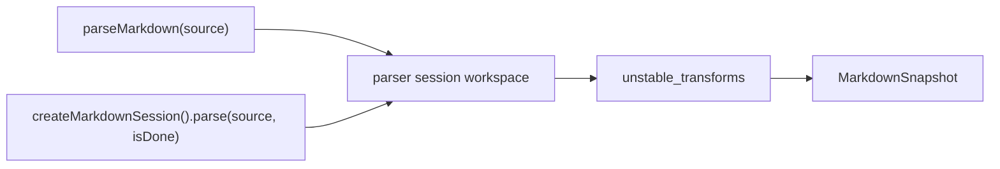
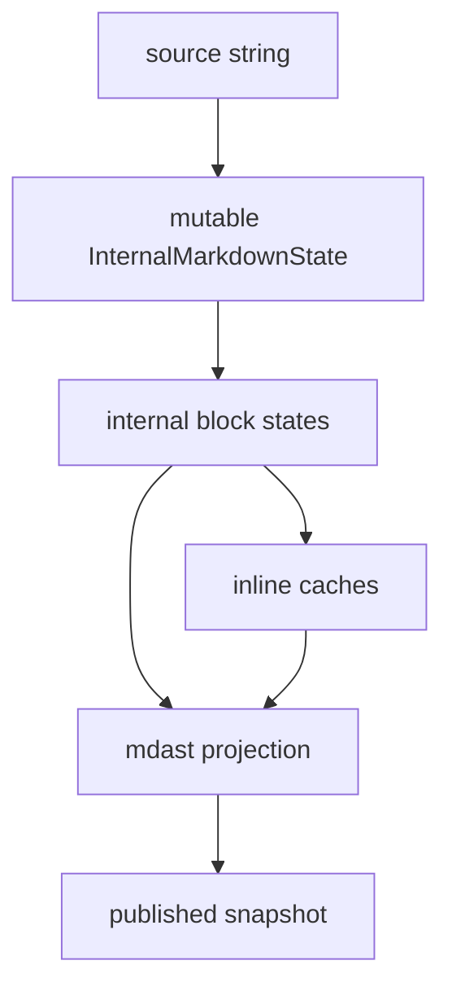
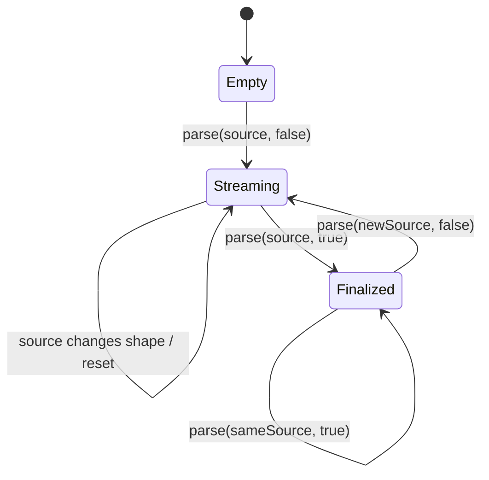

# Architecture

`@mistral/markdown` is an AST parser for Le Chat message workloads. It parses one Mistral markdown dialect and publishes mdast-compatible snapshots.

The public API is small. The implementation can be specialized.

## Goals

- Parse to mdast-compatible ASTs.
- Keep snapshots read-only by contract and preserve subtree identity where possible.
- Make append-only streaming cheap.
- Keep parser state private to the session.
- Keep product-specific rendering and custom-element behavior outside parser syntax.
- Keep full-message parsing competitive without adding a separate one-shot parser.

## Non-goals

- HTML rendering.
- Markdown directives.
- Runtime syntax-profile flags.
- Third-party syntax plugins.
- Arbitrary middle-of-document edits.
- Public parser-state inspection.
- Public checkpoint import or export.

## Public boundary



`parseMarkdown(source)` is the one-shot convenience API. It uses the same parser model as sessions and returns a finalized snapshot.

`createMarkdownSession()` owns the parser workspace. Its `parse(source, isDone?)` method receives the latest accumulated source string. It chooses append reuse when possible and resets when the source no longer extends the previous unfinished source.

`unstable_transforms` run after parsing and before publication. They project AST child arrays into consumer-owned nodes. They are not syntax plugins.

Experimental smoothing is available through the React hook at `@mistral/markdown/react`. It is presentation middleware over the parser session model, not part of parser syntax.

## Data ownership



The session workspace is mutable and private. It stores the buffered source, block states, reference indexes, footnote indexes, line cache, pending constructs, dirty-window offset, and inline caches.

Published snapshots are read-only by contract. The package does not freeze returned objects. Consumers must not mutate snapshots or AST nodes.

mdast is the public projection target. It is not required to be the hot-path internal representation.

## Parser layers

The parser is organized around these responsibilities:

- `src/session.ts`
  - public session state, append detection, reset behavior, transform publication
- `src/react.ts` and `src/react-store.ts`
  - optional React hook and private typewriter smoothing store
- `src/state.ts`
  - source append handling and line cache bookkeeping
- `src/parse.ts`
  - block parsing, dirty-tail rebuild, mdast projection
- `src/inline.ts`
  - inline event scanning, delimiter resolution, inline cache reuse, mdast child projection
- `src/html-scan.ts`
  - shared HTML scanners
- `src/character-reference.ts`
  - character-reference scanning and decoding
- `src/post-process.ts`
  - transform planning and AST projection hooks

Large parser files are acceptable while they keep hot-path flow local. Split code when the split reduces cognitive load or creates a real reusable scanner boundary.

## Optimization model

Streaming optimization is built around two parser-owned ideas:

- dirty-tail reparsing for append-only streams
- append-safe inline scanning and cache reuse inside the dirty tail

The parser does not have syntax modes, fixture-specific parser branches, or product-specific syntax branches. Rollback decisions belong in pending constructs and inline append-safety metadata.

Local fast paths are allowed when they are guarded by parser state and fall back to dirty-tail parsing:

- append a clean block suffix when the dirty offset equals the append offset
- append plain text inside an open paragraph
- append plain text inside the last paragraph of an open list item
- append bracket-aware inline cache state when a bracket parser can resume safely
- append plain inline text when the next characters cannot start supported inline syntax

Inline scanning uses a private event tape as the hot-path representation while rebuilding inline children. The tape stores parser-owned events such as text, delimiter markers, and already parsed inline leaves. The public mdast children are projected from that tape after delimiter resolution. This keeps mdast as the published format while giving the scanner a smaller internal boundary than mdast nodes.

New streaming optimizations should either narrow `reparseFromOffset`, improve pending-construct classification, or improve inline append-safe boundaries. If an optimization cannot be phrased in those terms, it needs a parser invariant before it lands.

## Incremental model

The parser optimizes append-only streams.



The dirty window is parser-owned. When a chunk arrives, the parser records how far back it must rebuild to preserve correctness. Open blocks, unresolved inline context, trailing block continuation candidates, and reference definitions can all move that boundary earlier.

Not every pending construct means the same thing. Some constructs force the streaming dirty window back because later text can immediately change visible output. Others are retained so finalization or late reference definitions can revisit earlier text. For example, dormant `inlineBracket` candidates are retained for finalization and reference-definition upgrades, but they do not always force every unrelated tail append to reparse from the bracket.

Append reuse must be semantic, not just textual. A byte prefix that is already scanned may still be unsafe if the next chunk can change its meaning.

Detailed incremental notes live in `docs/incremental-parsing.md`.

## Optimistic projection

Streaming output should avoid visible formatting flashes. Optimistic projection is a presentation-stability feature, not a raw parsing-speed feature.

The parser keeps unfinished constructs in internal state. Projection may synthesize temporary nodes for rendering and mark them under `node.data.mistralMarkdown`:

```ts
type MarkdownNodeFlags = {
  readonly unfinished?: true;
  readonly optimistic?: true;
};
```

Optimistic projection is conservative:

- high-confidence constructs can be projected before every closer has arrived, for example open fences, display math, inline code, emphasis, explicit link destinations, and parenthesized inline math
- ambiguous syntax should be suppressed rather than shown raw, for example dangling delimiters, partial table/list markers, and unresolved dollar tails
- finalized parsing remains authoritative; projection never changes what a completed source means

Finalized incremental output must match one-shot parsing for the same source. Finalization must not rely on a full fresh parse to hide session-state bugs.

## Adapter boundary

The parser core preserves HTML and custom elements as markdown syntax. It does not know Le Chat reference semantics, table metadata semantics, or renderer behavior.

Adapters may use `unstable_transforms` to turn parsed HTML leaves into product-owned nodes before rendering. Those transforms must not alter parser syntax or dirty-window behavior.

This boundary is what lets Le Chat replace directive-backed references without adding directive parsing to the core.

## Spec harness

The package uses a custom harness for official CommonMark and GFM corpora because those suites are large linear datasets with pass/fail accounting.

Vitest remains the right tool for parser unit tests, transform tests, smoothing tests, and focused regressions.

Harness details live in `docs/spec-harness.md`.
