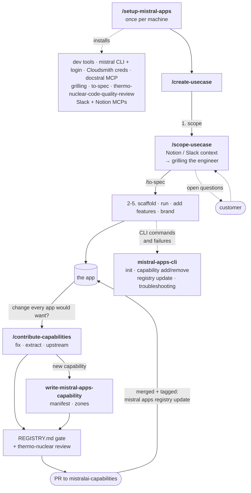

# mistralai-capabilities-skills

Agent skills for **building on the [`mistralai-capabilities`](https://github.com/mistralai/mistralai-capabilities)
registry** — scoping a use case, scaffolding and shipping a Mistral App, contributing a capability,
the `mistral apps` CLI reference, and machine setup.

This repository holds **only** these skills, so installing it with
[openskills](https://github.com/numman-ali/openskills) pulls exactly the six below and nothing
else. It is the source of truth; the skills are mirrored into `mistralai-capabilities` at `skills/`
as a git subtree.

> These are distinct from the `capabilities/*/template/.agents/skills/` skills in the registry,
> which are vendored into a *generated* app rather than installed into your coding agent.

## Install

openskills scans a repo for every `SKILL.md` and has no ignore mechanism, which is why these live in
a dedicated repo — the bare install is already scoped to the six skills:

```bash
npx openskills install mistralai/mistralai-capabilities-skills
```

Install a single skill by its subpath, or scan a local checkout:

```bash
npx openskills install mistralai/mistralai-capabilities-skills/create-usecase
npx openskills install ./                       # from a checkout of this repo
```

Append `--universal` or `--global` as your setup requires.

## Skills

| Skill | Purpose |
| --- | --- |
| [`setup-mistral-apps`](setup-mistral-apps/SKILL.md) | Set up a machine: dev tools (bun, uv, Python, Docker, node, gh), the `mistral` CLI and login, Cloudsmith credentials, the `docstral` MCP, review and engineering skills, Slack and Notion MCPs. |
| [`scope-usecase`](scope-usecase/SKILL.md) | Scope one use case by grilling the engineer, fed by Notion and Slack context, then `/to-spec`. |
| [`create-usecase`](create-usecase/SKILL.md) | Create a use case app: scope it with `scope-usecase`, then `apps init`, choose/trim capabilities, add features as workflow classes. |
| [`mistral-apps-cli`](mistral-apps-cli/SKILL.md) | Reference for the `mistral apps` CLI — install and login, `init`, `capability`, `registry`, `dev`, and its failure modes. |
| [`contribute-capabilities`](contribute-capabilities/SKILL.md) | Fix, extract, or author a capability and upstream it as a PR. See its [`REGISTRY.md`](contribute-capabilities/REGISTRY.md). |
| [`write-mistral-apps-capability`](write-mistral-apps-capability/SKILL.md) | Schema authority for authoring a new capability end-to-end. |

`scope-usecase` runs the `grilling` interview and ends on `to-spec`; `contribute-capabilities` runs
the `thermo-nuclear-code-quality-review` pass. Neither ships here: `setup-mistral-apps` installs them
from their upstreams, [`mattpocock/skills`](https://github.com/mattpocock/skills) and
[`cursor/plugins`](https://github.com/cursor/plugins).

## How they fit together



Read it top to bottom. Set up the machine once. Every new use case starts in `create-usecase`, which
runs a `scope-usecase` session first and builds from the spec it ends on. Any change that belongs to
every app goes back to the registry through `contribute-capabilities`. `mistral-apps-cli` is the
reference behind every `mistral apps` command along the way.

## Contributing

Edit the skill here, then propagate to the registry subtree from a `mistralai-capabilities` checkout:

```bash
git subtree pull --prefix=skills \
  https://github.com/mistralai/mistralai-capabilities-skills.git main --squash
```

Changes made inside the registry's `skills/` can be published back with the matching
`git subtree push`.
